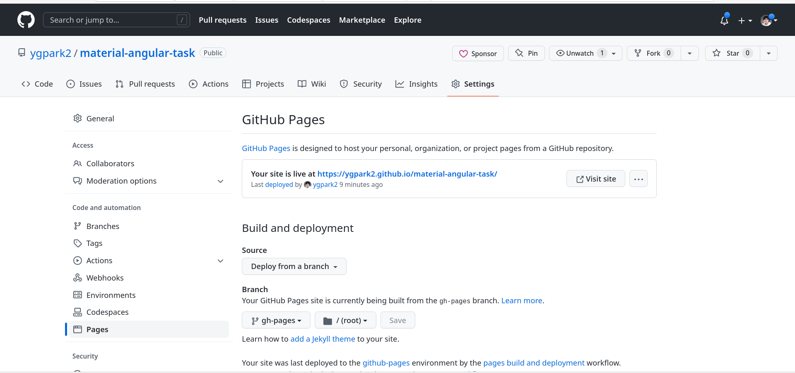

# Material Angular Task


Task Application built with [Angular](https://angular.io/) 15 and hosted on [GitHub Pages](https://pages.github.com/) using [GitHub Actions](https://github.com/actions).

## Prerequisites

Before you start, you need to install and configure the tools:

* [git](https://git-scm.com/)
* [Node.js and npm](https://nodejs.org/)
* [Angular CLI](https://angular.io/cli)
* IDE (e.g. [Visual Studio Code](https://code.visualstudio.com/))


## Getting started


**1.** Run the dependency installation with the command below.

```shell
npm install
```

**2.** Run the application with the command below. Access the URL `http://localhost:4200/` and check if the application is working.

```shell
npm start
```

**3.** Build the application with the command below.

```shell
npm run build:prod

> app@0.0.0 build:prod
> ./node_modules/.bin/ng build --configuration production --base-href https://ygpark2.github.io/material-angular-task/

✔ Browser application bundle generation complete.
✔ Copying assets complete.
✔ Index html generation complete.

Initial Chunk Files           | Names                    |  Raw Size | Estimated Transfer Size
main.52c3ebd328dadca0.js      | main                     | 819.52 kB |               182.45 kB
styles.9e810386664a3255.css   | styles                   | 107.18 kB |                 9.44 kB
polyfills.74724d6b8c97b26b.js | polyfills                |  33.05 kB |                10.68 kB
runtime.aa6b31f7481f7ef7.js   | runtime                  |   2.61 kB |                 1.23 kB

                              | Initial Total            | 962.36 kB |               203.81 kB

Lazy Chunk Files              | Names                    |  Raw Size | Estimated Transfer Size
119.5e19d43d4ff681b0.js       | modules-home-home-module |   9.22 kB |                 2.48 kB

Build at: 2023-02-08T08:07:47.926Z - Hash: e0fad6ca79377044 - Time: 37259ms
```

**4.** Syncronize the application on the GitHub repository that was created.


**5.** Ready! After synchronizing the application on the GitHub repository, the GitHub Actions build the application and synchronize on the branch `gh-pages`. Access the URL [https://ygpark2.github.io/material-angular-task/](https://ygpark2.github.io/material-angular-task/) and check if the application is working. Replace the `ygpark2` value with your GitHub username.


​### Validate the run of the GitHub Actions flow

**1.** Let's validate the run of the GitHub Actions flow. Access the repository [https://github.com/ygpark2/material-angular-task](https://github.com/ygpark2/material-angular-task) created and click on the link *Actions*.


**2.** Click on the flow runned.


**3.** Click on the job *deploy*.


**4.** Click on each step to validate the run.


**5.** Ready! We validate the run of the GitHub Actions flow.


### Validate the publish of the GitHub Pages

**1.** Let's validate the publish of the GitHub Pages. Access the repository [https://github.com/ygpark2/material-angular-task](https://github.com/ygpark2/material-angular-task) created and click on the link *Settings*.


**2.** Click on the menu *Pages*.


**3.** The message *Your site is published at https://rodrigokamada.github.io/angular-github-actions/* should be displayed.



**4.** Ready! We validate the publish of the GitHub Pages.
